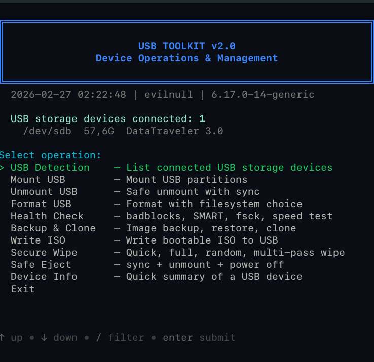

# USB Toolkit

All-in-one USB device management tool for Linux. Format, mount, backup, write ISOs, health check, secure wipe — all from a single interactive terminal UI powered by [gum](https://github.com/charmbracelet/gum).



## Features

| Category | Description |
|----------|-------------|
| **USB Detection** | List connected USB storage devices with full details |
| **Mount USB** | Mount partitions with read-only, custom options, or specific mount point |
| **Unmount USB** | Safe unmount with sync, force unmount, or unmount all |
| **Format USB** | MBR/GPT partition table, 7 filesystems (FAT32, exFAT, NTFS, ext4, Btrfs, F2FS, XFS) |
| **Health Check** | badblocks, SMART status, fsck, read/write speed test |
| **Backup & Clone** | Image backup (none/gzip/zstd compression), restore, device clone |
| **Write ISO** | Write bootable ISO to USB with SHA256 verification |
| **Secure Wipe** | Quick wipe, full zero, random wipe, 3-pass multi-pass |
| **Safe Eject** | sync + unmount + USB power off |
| **Device Info** | Detailed device summary, partitions, block info |

## Quick Start

```bash
sudo bash usb-toolkit.sh
```

## Requirements

- Bash 4.0+
- Linux (Ubuntu / Debian / Zorin OS / Arch / Fedora)
- Root access required
- Optional: [gum](https://github.com/charmbracelet/gum) for modern interactive UI (works without it too)

## Dependencies

**Required:** `parted`, `lsblk`, `blkid`, `wipefs`, `dd`, `mkfs.*`

**Optional:** `gum` (interactive UI), `smartctl` (SMART health), `pv` (progress bars), `zstd` (backup compression), `badblocks` (disk test)

## License

[MIT](LICENSE)

